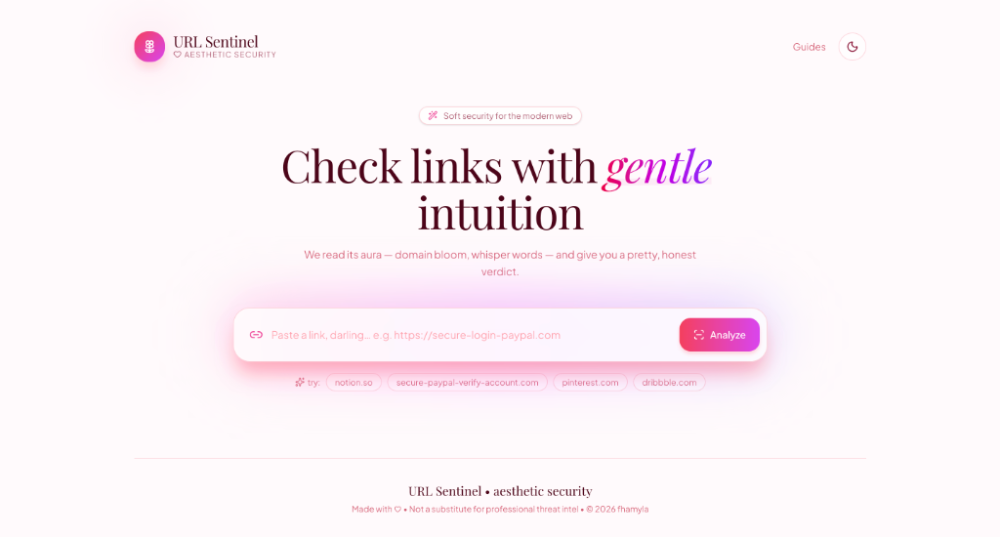
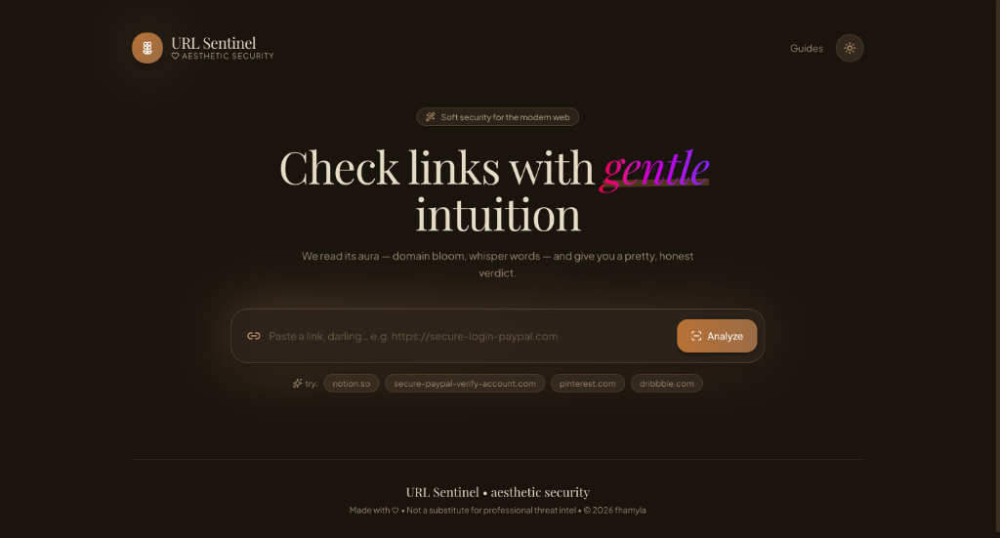

# 🌸 URL Sentinel — Aesthetic Security 🌸

URL Sentinel is a lightweight, machine-learning-powered web application designed to analyze URLs for phishing signals using a soft, modern, and aesthetic interface. 

It reads a URL's "aura" using 40+ structural signals, domain age, and keyword risks, feeding them into a trained **Random Forest** classifier (achieving **92.2% Accuracy** and **92.0% F1-score**) to deliver a detailed risk assessment.

https://url-sentinel-sepia.vercel.app/




---

## ✨ System Features

*   **Aura Analysis**: Instant security verdicts ("Safe & Sweet", "Hmm... Suspicious", "Phishing Alert") mapped to beautiful, soft gradient auras.
*   **Signal Garden**: A modern inspection panel breakdown covering:
    *   *Domain Bloom* (Registration age)
    *   *Whisper Words* (Urgent keywords like *verify*, *secure*, *paypal*)
    *   *TLD Petal* (Detection of commonly abused top-level domains)
*   **Recent Scans**: Persistence of recent scans locally (via LocalStorage) and via API history.
*   **Advanced ML Pipeline**: A complete custom training script (`train_model.py`) that evaluates and compares multiple classification models (Random Forest, Extra Trees, Hist Gradient Boosting, Decision Trees, Logistic Regression).

---

## 📂 Project Structure

```
URL Sentinel/
├── backend/
│   ├── .venv/                  # Python virtual environment (Python 3.14)
│   ├── dataset/
│   │   └── phishing_site_urls.csv # CSV dataset for training (~31MB)
│   ├── db.py                   # Mock Database persistence handler
│   ├── feature_extractor.py    # Feature extraction logic (entropy, path length, TLDs, etc.)
│   ├── features.csv            # Cached extracted features for fast training (~62MB)
│   ├── phishing_model.pkl      # Saved trained best machine learning model
│   ├── predict_url.py          # Command line prediction tool
│   ├── server.py               # Lightweight HTTPServer API backend
│   └── train_model.py          # ML training and model comparison pipeline
│
└── frontend/
    ├── src/
    │   ├── App.tsx             # Main React application & beautiful UI layout
    │   ├── index.css           # Styling configuration (fonts & Tailwind CSS)
    │   └── main.tsx            # Frontend entrypoint
    ├── package.json            # React & Vite packages
    └── vite.config.ts          # Vite configuration
```

---

## 🚀 Getting Started

Ensure you have **Node.js** and **Python 3.14** installed on your system.

### 1. Run the Backend API Server

The backend is built with Python's standard library `HTTPServer` (no external framework required) and imports scientific libraries from its dedicated virtual environment.

```bash
# Navigate to the backend folder
cd backend

# Option A: Start the server using the configured virtual environment's Python (Recommended)
./.venv/bin/python server.py

# Option B: Activate the environment first, then run
source .venv/bin/activate
python server.py
```

*   The backend will start and listen on **`http://127.0.0.1:8000`**.
*   It automatically creates in-memory databases and attempts to load `phishing_model.pkl`.

---

### 2. Run the Frontend Dev Server

The frontend uses React 19, Tailwind CSS v4, and Vite.

```bash
# Open a new terminal window and navigate to the frontend folder
cd frontend

# Install package dependencies
npm install

# Start the Vite development server
npm run dev
```

*   The frontend dev server will start (typically at **`http://localhost:5173`**).
*   Open the URL in your browser to start checking links!

---

## 🧠 Model Training & Retraining

You can customize, retrain, and tune the classification model using the dataset provided in `backend/dataset/phishing_site_urls.csv`.

To retrain the model and save the best performer as `phishing_model.pkl`:

```bash
cd backend

# Run the training script on the full dataset
./.venv/bin/python train_model.py

# For quick experimentation (limit training size to 5,000 samples)
./.venv/bin/python train_model.py --max-rows 5000

# Force rebuild of cached features (re-run feature extraction from raw CSV)
./.venv/bin/python train_model.py --rebuild-features
```

### Available Command-line Arguments:
*   `--dataset-path`: Specify path to input CSV dataset (defaults to `dataset/phishing_site_urls.csv`).
*   `--features-cache`: Specify path to output/input features CSV (defaults to `features.csv`).
*   `--max-rows`: Cap the number of dataset rows processed (highly recommended for fast iteration).
*   `--rebuild-features`: Re-run the batch feature extractor instead of loading `features.csv`.
*   `--skip-svm`: Skip training the SVM model (SVM can be extremely slow on large datasets).

---

## 🔌 API Documentation

All endpoints are hosted on **`http://localhost:8000`**.

### 1. Analyze a URL
*   **Endpoint:** `POST /api/analyze`
*   **Payload:**
    ```json
    {
      "url": "https://secure-paypal-verify-account.com/login"
    }
    ```
*   **Response:**
    ```json
    {
      "url": "https://secure-paypal-verify-account.com/login",
      "domain": "secure-paypal-verify-account.com",
      "verdict": "phishing",
      "riskScore": 78,
      "confidence": 85,
      "scannedAt": "2026-06-13T14:40:00Z",
      "aura": "Rose warning • Likely deceptive",
      "summary": "Dangerous energy detected. This URL shows strong phishing traits — it may be trying to steal your information.",
      "features": [
        { "id": "domain-age", "label": "Domain Bloom", "value": "12 months", "status": "good" },
        ...
      ]
    }
    ```

### 2. Fetch Recent Scans History
*   **Endpoint:** `GET /api/history`
*   **Response:** Array of the latest 20 analyzed URL results.

### 3. Fetch Loaded ML Model Metrics
*   **Endpoint:** `GET /api/model-info`
*   **Response:** Detailed metrics (Accuracy, F1, Precision, Recall, tuning threshold) for the active machine learning model.

---

## ☁️ Cloud Deployment

### 1. Deploy the Backend on Render
1. Create a new **Web Service** on [Render](https://render.com/).
2. Connect your GitHub repository.
3. Configure the following service settings:
   - **Root Directory**: `backend`
   - **Runtime**: `Python`
   - **Build Command**: `pip install -r requirements.txt`
   - **Start Command**: `python server.py`
4. Add the following **Environment Variables** in the Render Dashboard:
   - `PORT`: (Render sets this dynamically, e.g., `8000`)
   - `FIREBASE_PROJECT_ID` (Optional): Your Firebase Firestore project ID.
   - `FIREBASE_SERVICE_ACCOUNT_PATH` (Optional): The service account raw JSON credentials string (must start with `{`). If provided, scan history will persist to Firebase Firestore.
5. Hit **Create Web Service**. Render will deploy the API server (e.g., `https://url-sentinel-api.onrender.com`).

### 2. Deploy the Frontend on Vercel
1. Create a new project on [Vercel](https://vercel.com/).
2. Connect your GitHub repository.
3. Configure the following project settings:
   - **Root Directory**: `frontend`
   - **Framework Preset**: `Vite` (automatically detected)
   - **Build Command**: `npm run build`
   - **Output Directory**: `dist`
4. Add the following **Environment Variable**:
   - `VITE_API_URL`: Set this to your deployed Render backend URL (e.g. `https://url-sentinel-api.onrender.com`). Do not append a trailing slash.
5. Click **Deploy**. Vercel will host your aesthetic UI!